<div align="center">

# 🎪 EventHub
### *ระบบบริหารจัดการและลงทะเบียนเข้าร่วมกิจกรรมครบวงจร*
*All-in-One Event Management & Registration Platform*

[](https://laravel.com)
[](https://www.php.net/)
[](https://livewire.laravel.com/)
[](https://tailwindcss.com/)
[](https://getbootstrap.com/)
[](LICENSE)

<br>

<p align="center">
  <strong>"ที่เดียวครบจบทุกกิจกรรม"</strong><br>
  แพลตฟอร์มศูนย์รวมกิจกรรมและอีเวนต์สำหรับสถาบันการศึกษาและบุคคลทั่วไป<br>
  ตอบโจทย์ทั้งผู้เข้าร่วมกิจกรรมและผู้จัดงาน ด้วยระบบที่ทันสมัย สะดวก ใช้งานง่าย และครอบคลุมทุกกระบวนการ
</p>

<p align="center">
  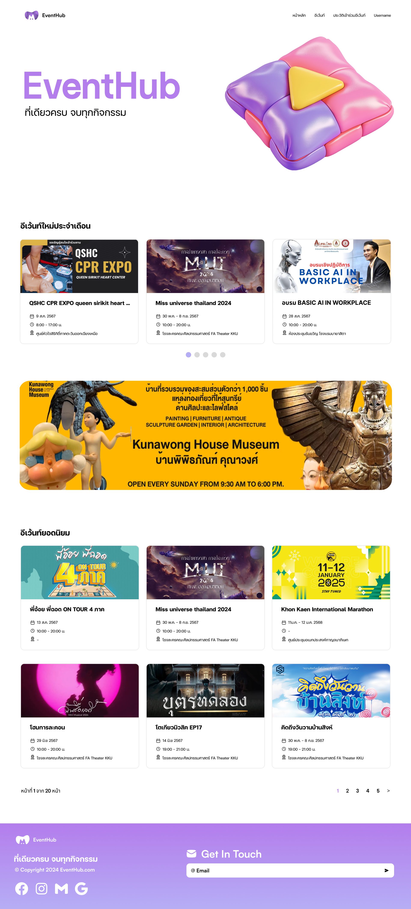
</p>

</div>

---

## 📌 สารบัญ (Table of Contents)

- [📸 ภาพตัวอย่างหน้าจอระบบ (UI Prototype Showcase)](#-ภาพตัวอย่างหน้าจอระบบ-ui-prototype-showcase)
  - [1. ฝั่งผู้ใช้งานทั่วไป / นักศึกษา (User & Student Flow)](#1-ฝั่งผู้ใช้งานทั่วไป--นักศึกษา-user--student-flow)
  - [2. ฝั่งผู้ดูแลระบบ / ผู้จัดงาน (Admin & Organizer Flow)](#2-ฝั่งผู้ดูแลระบบ--ผู้จัดงาน-admin--organizer-flow)
- [✨ ไฮไลท์และฟีเจอร์เด่น (Key Features)](#-ไฮไลท์และฟีเจอร์เด่น-key-features)
  - [สำหรับผู้ใช้งาน / นักศึกษา (User / Student)](#-สำหรับผู้ใช้งาน--นักศึกษา-user--student)
  - [สำหรับผู้ดูแลระบบ / ผู้จัดงาน (Admin / Organizer)](#-สำหรับผู้ดูแลระบบ--ผู้จัดงาน-admin--organizer)
- [🔄 ลำดับขั้นตอนการทำงาน (System Workflow)](#-ลำดับขั้นตอนการทำงาน-system-workflow)
- [🛠️ เทคโนโลยีที่ใช้ (Tech Stack)](#️-เทคโนโลยีที่ใช้-tech-stack)
- [🗄️ โครงสร้างฐานข้อมูล (Database Schema)](#️-โครงสร้างฐานข้อมูล-database-schema)
- [💻 ข้อกำหนดระบบและการติดตั้ง (Installation Guide)](#-ข้อกำหนดระบบและการติดตั้ง-installation-guide)
  - [สิ่งที่ต้องเตรียมล่วงหน้า (Prerequisites)](#สิ่งที่ต้องเตรียมล่วงหน้า-prerequisites)
  - [ขั้นตอนการติดตั้ง (Setup Steps)](#ขั้นตอนการติดตั้ง-setup-steps)
- [📂 โครงสร้างโปรเจกต์ (Project Structure)](#-โครงสร้างโปรเจกต์-project-structure)
- [🔒 สิทธิ์การใช้งานและบัญชีผู้ใช้ (Roles & Access)](#-สิทธิ์การใช้งานและบัญชีผู้ใช้-roles--access)
- [👥 ผู้พัฒนา (Author & Contributors)](#-ผู้พัฒนา-author--contributors)
- [📄 ใบอนุญาต (License)](#-ใบอนุญาต-license)

---

## 📸 ภาพตัวอย่างหน้าจอระบบ (UI Prototype Showcase)

### 1. ฝั่งผู้ใช้งานทั่วไป / นักศึกษา (User & Student Flow)

#### 🔐 ระบบเข้าสู่ระบบและสมัครสมาชิก (Authentication)
<table>
  <tr>
    <td width="50%" align="center"><strong>หน้าเข้าสู่ระบบ (Login)</strong></td>
    <td width="50%" align="center"><strong>หน้าลงทะเบียนผู้ใช้ใหม่ (Register)</strong></td>
  </tr>
  <tr>
    <td>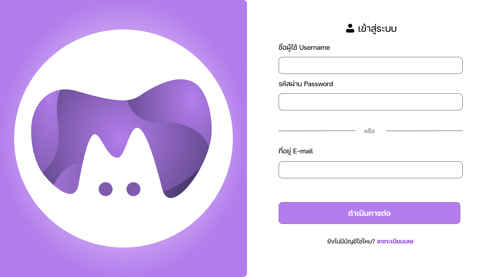</td>
    <td>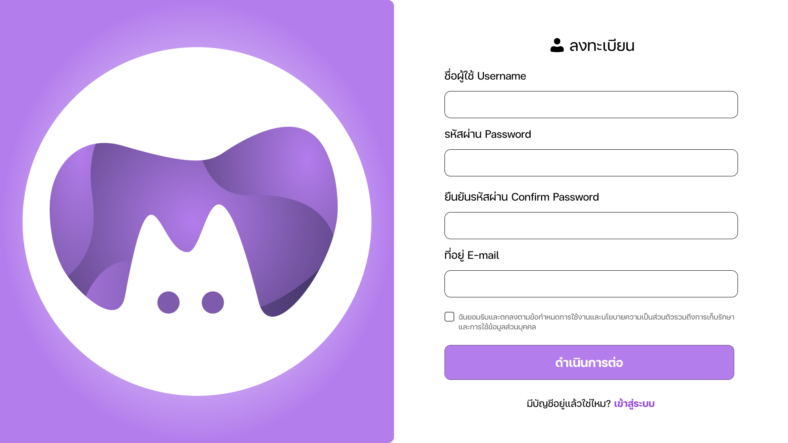</td>
  </tr>
</table>

#### 🔍 ค้นหาและดูรายละเอียดกิจกรรม (Discovery & Details)
<table>
  <tr>
    <td width="50%" align="center"><strong>หน้าค้นหาและคัดกรองกิจกรรม (Search & Filter)</strong></td>
    <td width="50%" align="center"><strong>หน้ารายละเอียดกิจกรรม (Event Details)</strong></td>
  </tr>
  <tr>
    <td>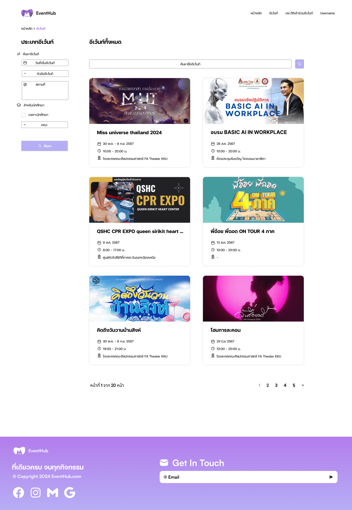</td>
    <td>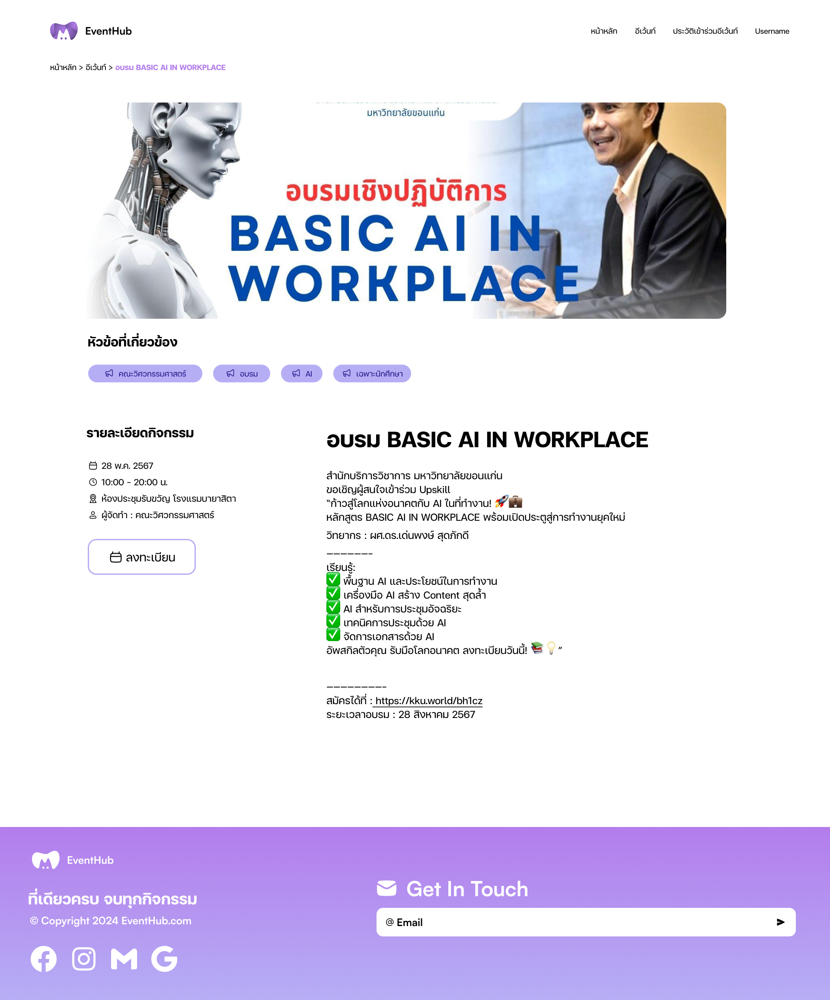</td>
  </tr>
</table>

#### 📝 ลงทะเบียนเข้าร่วมและติดตามสถานะ (Registration & Tracker)
<table>
  <tr>
    <td width="50%" align="center"><strong>แบบฟอร์มลงทะเบียนเข้าร่วม (Event Registration)</strong></td>
    <td width="50%" align="center"><strong>ประวัติและสถานะการเข้าร่วม (My Events)</strong></td>
  </tr>
  <tr>
    <td>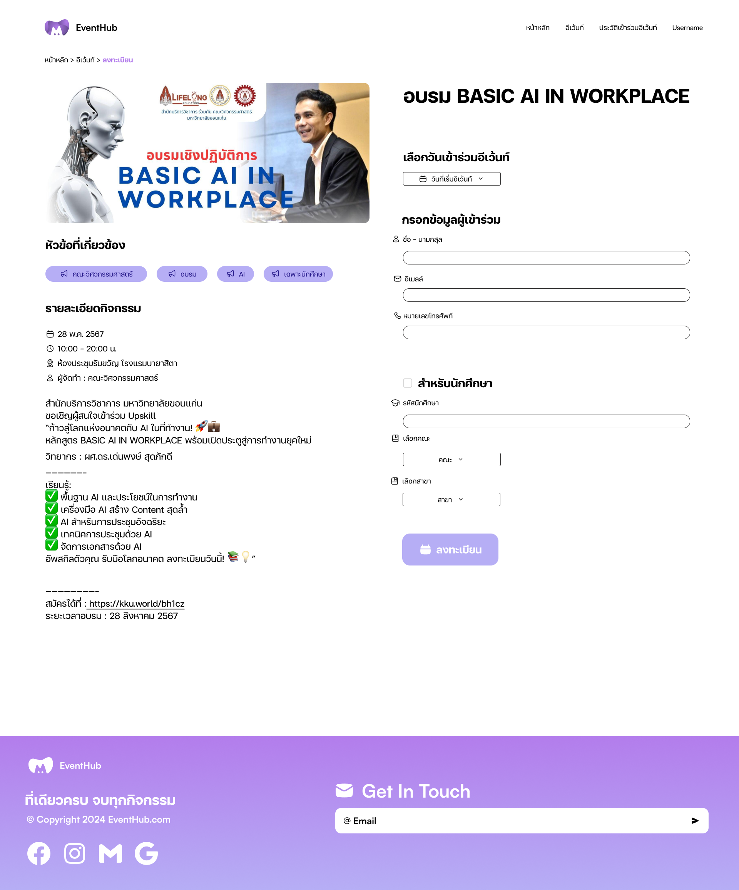</td>
    <td>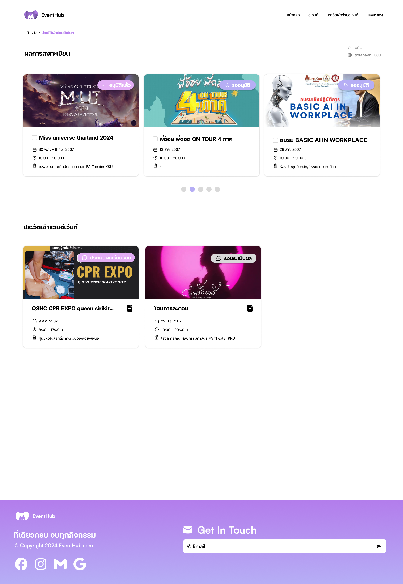</td>
  </tr>
</table>

#### ⭐ แบบประเมินและให้คะแนนความพึงพอใจ (Evaluation & Feedback)
<div align="center">
  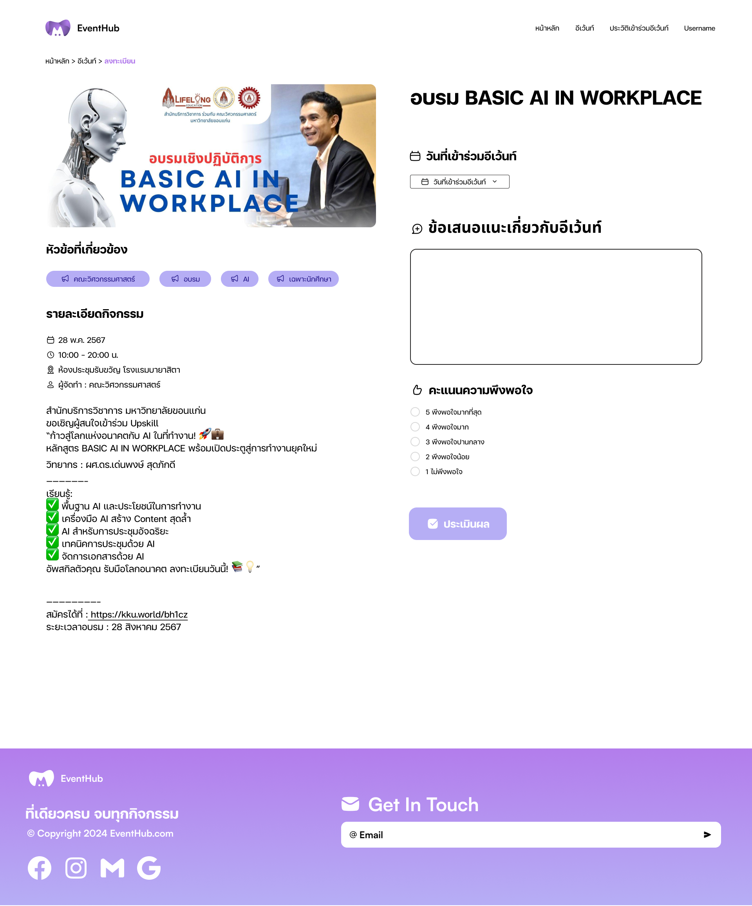
  <p><em>หน้าแบบประเมินความพึงพอใจและให้คะแนนระดับ 1-5 ดาวหลังเสร็จสิ้นกิจกรรม</em></p>
</div>

<br>

### 2. ฝั่งผู้ดูแลระบบ / ผู้จัดงาน (Admin & Organizer Flow)

#### 📊 แดชบอร์ดภาพรวมกิจกรรม (Admin Dashboard)
<div align="center">
  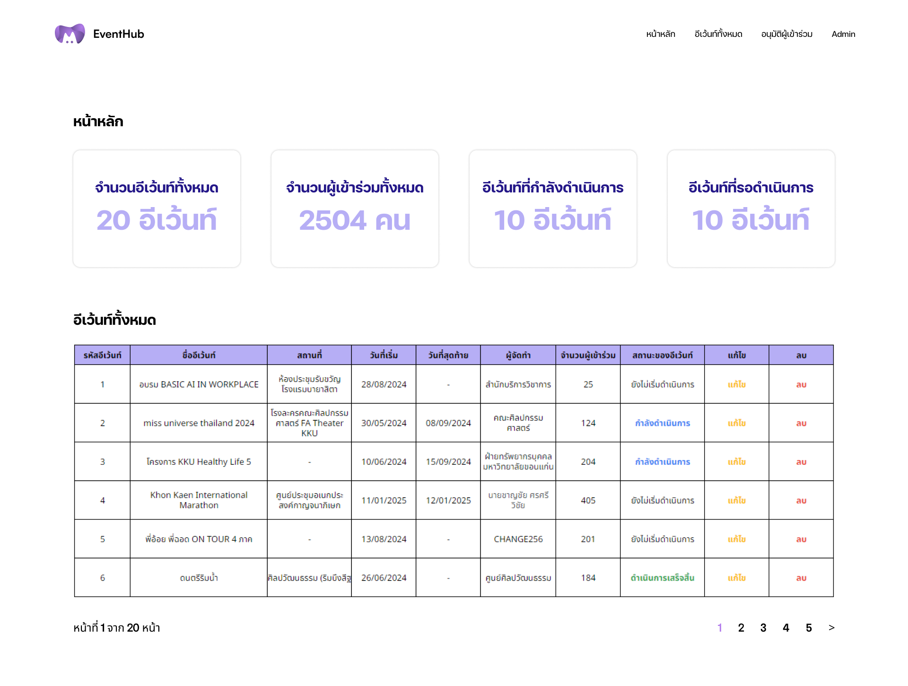
  <p><em>ศูนย์ควบคุมและจัดการกิจกรรม พร้อมคัดกรองสถานะกิจกรรม</em></p>
</div>

#### ➕ การสร้างและแก้ไขกิจกรรม (Event Creation & Management)
<table>
  <tr>
    <td width="50%" align="center"><strong>หน้าสร้างกิจกรรมใหม่ (Create Event)</strong></td>
    <td width="50%" align="center"><strong>หน้าแก้ไขข้อมูลกิจกรรม (Edit Event)</strong></td>
  </tr>
  <tr>
    <td>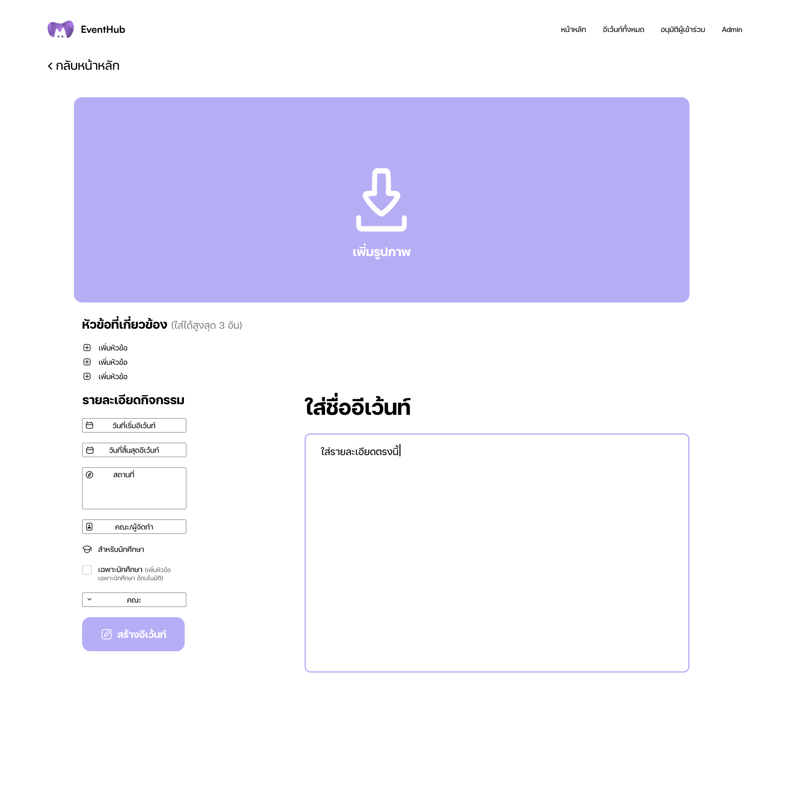</td>
    <td>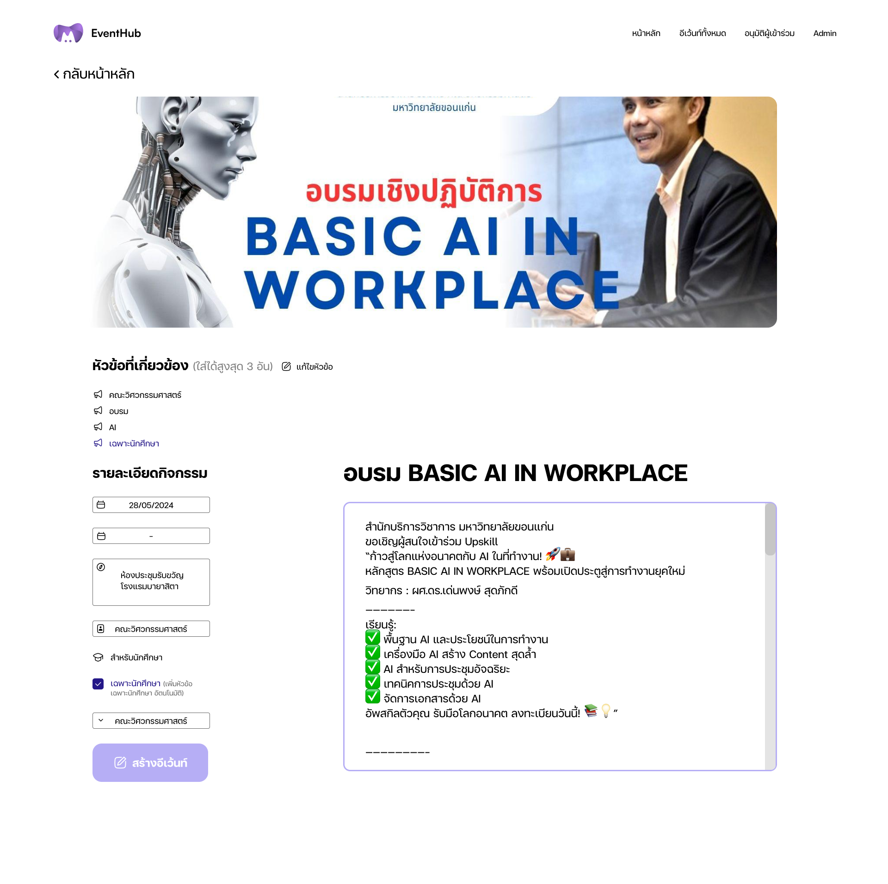</td>
  </tr>
</table>

#### 👥 การตรวจสอบและอนุมัติผู้เข้าร่วม (Participant Approval & Bulk Action)
<table>
  <tr>
    <td width="50%" align="center"><strong>ภาพรวมผู้สมัครเข้าร่วมกิจกรรม (Participants Overview)</strong></td>
    <td width="50%" align="center"><strong>ระบบอนุมัติ / ปฏิเสธผู้สมัคร (Approval Actions)</strong></td>
  </tr>
  <tr>
    <td>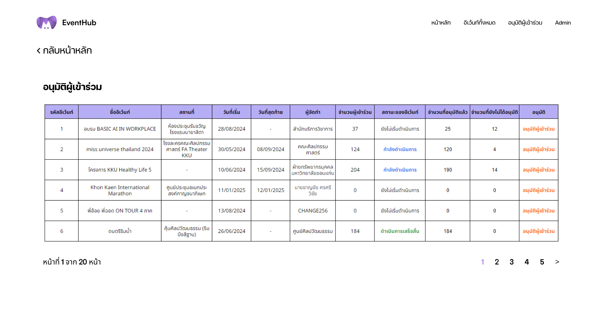</td>
    <td>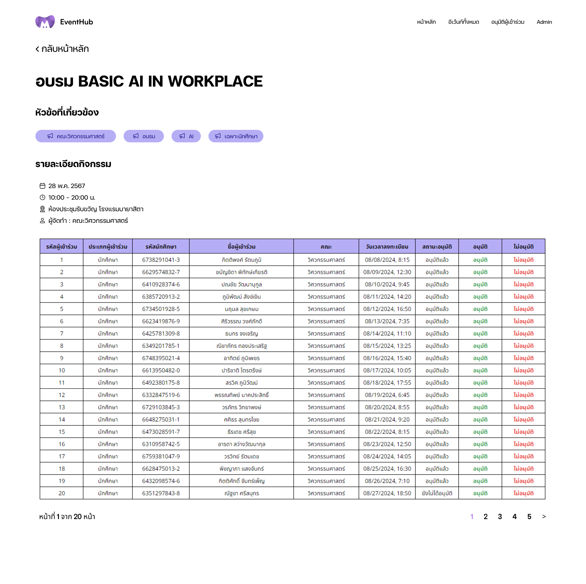</td>
  </tr>
</table>

#### 🗑️ หน้าต่างยืนยันการลบกิจกรรม (Delete Confirmation)
<div align="center">
  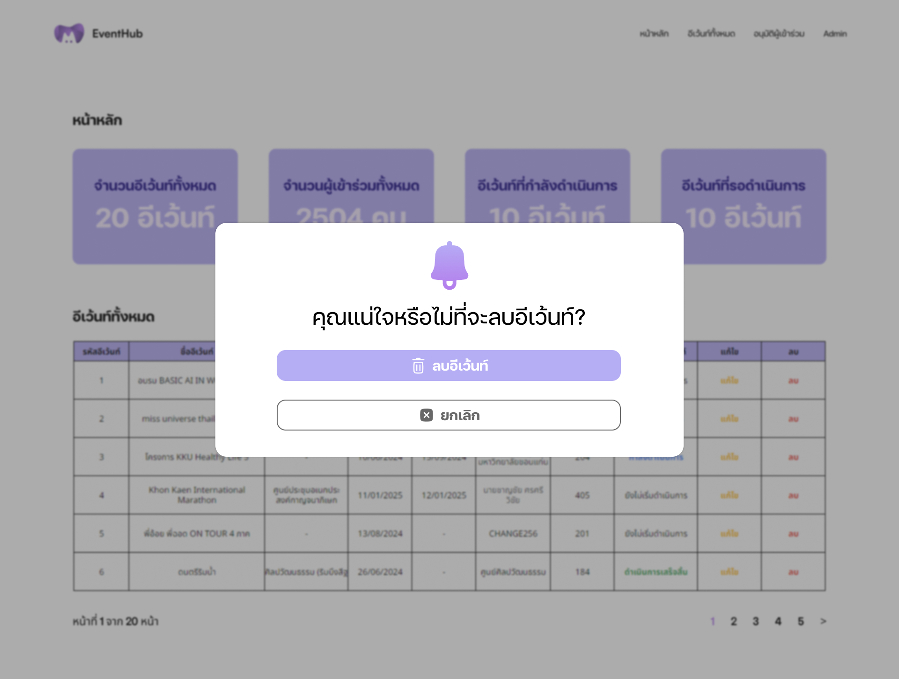
  <p><em>หน้าต่าง Modal ยืนยันความปลอดภัยก่อนดำเนินการลบกิจกรรมออกจากระบบ</em></p>
</div>

---

## ✨ ไฮไลท์และฟีเจอร์เด่น (Key Features)

### 👤 สำหรับผู้ใช้งาน / นักศึกษา (User / Student)
- **🔍 ระบบค้นหาและคัดกรองกิจกรรม (Event Discovery & Search):**
  - ค้นหากิจกรรมตามชื่อ และกรองตามหมวดหมู่/ประเภทกิจกรรม
  - แสดงสถานะกิจกรรมชัดเจน: `รอลงทะเบียน`, `อยู่ในช่วงลงทะเบียน`, `หมดเวลาลงทะเบียน`
- **📝 ระบบลงทะเบียนเข้าร่วมกิจกรรม (Smart Registration):**
  - ตรวจสอบโควตาจำนวนผู้เข้าร่วมสูงสุดอัตโนมัติ (เต็มแล้วปิดรับสมัครทันที)
  - เลือกระบุช่วงวันที่เข้าร่วมกิจกรรมได้ยืดหยุ่น
  - รองรับเงื่อนไขเฉพาะนักศึกษา (ระบบบันทึกรหัสนักศึกษา คณะ และสาขาวิชา)
  - ป้องกันการลงทะเบียนซ้ำซ้อนในกิจกรรมเดียวกัน
- **📋 ตรวจสอบประวัติและสถานะ (Registration Tracker):**
  - ตรวจสอบสถานะการสมัคร: `รอการอนุมัติ`, `อนุมัติแล้ว`, `ไม่ผ่านการอนุมัติ`
  - ยกเลิกการลงทะเบียนได้ด้วยตนเอง
- **⭐ ระบบแบบประเมินและรีวิว (Rating & Feedback):**
  - ประเมินความพึงพอใจและให้คะแนน 1 - 5 ดาวหลังสิ้นสุดกิจกรรม
  - บันทึกความคิดเห็นและข้อเสนอแนะเพื่อนำไปพัฒนากิจกรรมถัดไป

---

### 🛡️ สำหรับผู้ดูแลระบบ / ผู้จัดงาน (Admin / Organizer)
- **📊 แดชบอร์ดบริหารจัดการกิจกรรม (Admin Dashboard):**
  - ดูภาพรวมและคัดกรองกิจกรรมตามสถานะ (รออนุมัติ, กำลังดำเนินการ, สิ้นสุดแล้ว, ยกเลิก)
  - รายการกิจกรรมแสดงผลแบบแบ่งหน้า (Pagination)
- **➕ จัดการกิจกรรม (Event Management - CRUD):**
  - สร้างกิจกรรมใหม่ พร้อมอัปโหลดรูปภาพโปสเตอร์ (Poster Image)
  - กำหนดวันจัดงาน, ช่วงเวลาเปิด-ปิดรับสมัคร, สถานที่จัดงาน, และจำนวนผู้เข้าร่วมสูงสุด
  - กำหนดสิทธิ์กิจกรรม (เปิดทั่วไป หรือ เฉพาะนักศึกษา)
  - แก้ไขรายละเอียดและลบกิจกรรม
- **👥 จัดการและอนุมัติผู้เข้าร่วม (Participant Management):**
  - ตรวจสอบรายชื่อผู้สมัครเข้าร่วมกิจกรรม พร้อมข้อมูลคณะ/สาขา
  - อนุมัติ (Approve), ไม่อนุมัติ (Unapprove) หรือลบผู้สมัคร ได้แบบเลือกหลายรายการ (Bulk Action)
- **📈 รายงานสถิติและการประเมินผล (Event Analytics & Report):**
  - สรุปอัตราส่วนจำนวนผู้เข้าร่วมจริงเทียบกับโควตาสูงสุด
  - คำนวณคะแนนความพึงพอใจเฉลี่ยของกิจกรรม
  - กราฟและตัวเลขแจกแจงสถิติคะแนนระดับ 1 ถึง 5 ดาว

---

## 🔄 ลำดับขั้นตอนการทำงาน (System Workflow)

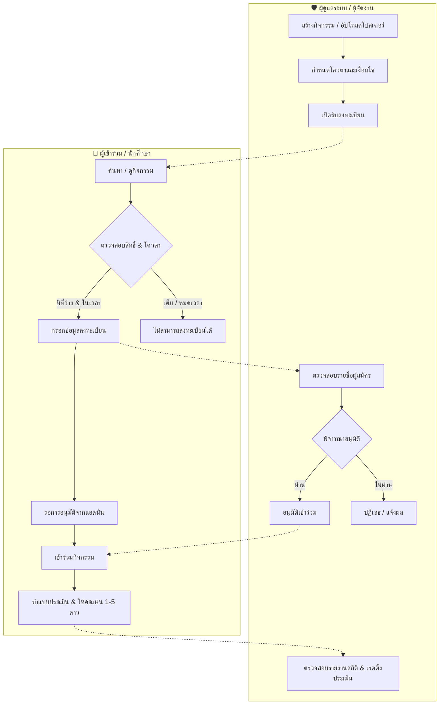
```mermaid
flowchart TD
    subgraph Admin ["🛡️ ผู้ดูแลระบบ / ผู้จัดงาน"]
        A1[สร้างกิจกรรม / อัปโหลดโปสเตอร์] --> A2[กำหนดโควตาและเงื่อนไข]
        A2 --> A3[เปิดรับลงทะเบียน]
        A4[ตรวจสอบรายชื่อผู้สมัคร] --> A5{พิจารณาอนุมัติ}
        A5 -- ผ่าน --> A6[อนุมัติเข้าร่วม]
        A5 -- ไม่ผ่าน --> A7[ปฏิเสธ / แจ้งผล]
        A8[ตรวจสอบรายงานสถิติ & เรตติ้งประเมิน]
    end

    subgraph User ["👤 ผู้เข้าร่วม / นักศึกษา"]
        U1[ค้นหา / ดูกิจกรรม] --> U2{ตรวจสอบสิทธิ์ & โควตา}
        U2 -- มีที่ว่าง & ในเวลา --> U3[กรอกข้อมูลลงทะเบียน]
        U2 -- เต็ม / หมดเวลา --> U4[ไม่สามารถลงทะเบียนได้]
        U3 --> U5[รอการอนุมัติจากแอดมิน]
        U5 --> U6[เข้าร่วมกิจกรรม]
        U6 --> U7[ทำแบบประเมิน & ให้คะแนน 1-5 ดาว]
    end

    A3 -.-> U1
    U3 -.-> A4
    A6 -.-> U6
    U7 -.-> A8
```

---

## 🛠️ เทคโนโลยีที่ใช้ (Tech Stack)

| หมวดหมู่ | เทคโนโลยี / เครื่องมือ | รายละเอียด |
| :--- | :--- | :--- |
| **Backend Framework** | [Laravel 11.x](https://laravel.com/) | PHP Web Application Framework |
| **Language** | [PHP 8.2+](https://www.php.net/) | Core Backend Language |
| **Authentication & UI** | [Laravel Jetstream](https://jetstream.laravel.com/) + [Sanctum](https://laravel.com/docs/sanctum) | ระบบยืนยันตัวตน, Session และ Profile Management |
| **Reactive Component** | [Livewire 3.x](https://livewire.laravel.com/) | ไดนามิกคอมโพเนนต์โดยไม่ต้องเขียน JavaScript ซับซ้อน |
| **Database & ORM** | [MySQL](https://www.mysql.com/) / [SQLite](https://www.sqlite.org/) | จัดการข้อมูลผ่าน Eloquent ORM และ Migration |
| **Styling & Design** | [Tailwind CSS](https://tailwindcss.com/) + [Bootstrap](https://getbootstrap.com/) | สไตล์ลิ่ง UI และเลย์เอาต์ที่ Responsive |
| **Icons & Fonts** | [Bootstrap Icons](https://icons.getbootstrap.com/) & Google Fonts | ไอคอนและฟอนต์ Prompt รองรับภาษาไทยสวยงาม |
| **Build Tool** | [Vite](https://vitejs.dev/) | Bundler ทรงพลังสำหรับการคอมไพล์ Frontend Asset |

---

## 🗄️ โครงสร้างฐานข้อมูล (Database Schema)

ระบบประกอบด้วยตารางหลักที่เชื่อมโยงกันอย่างเป็นระบบ:

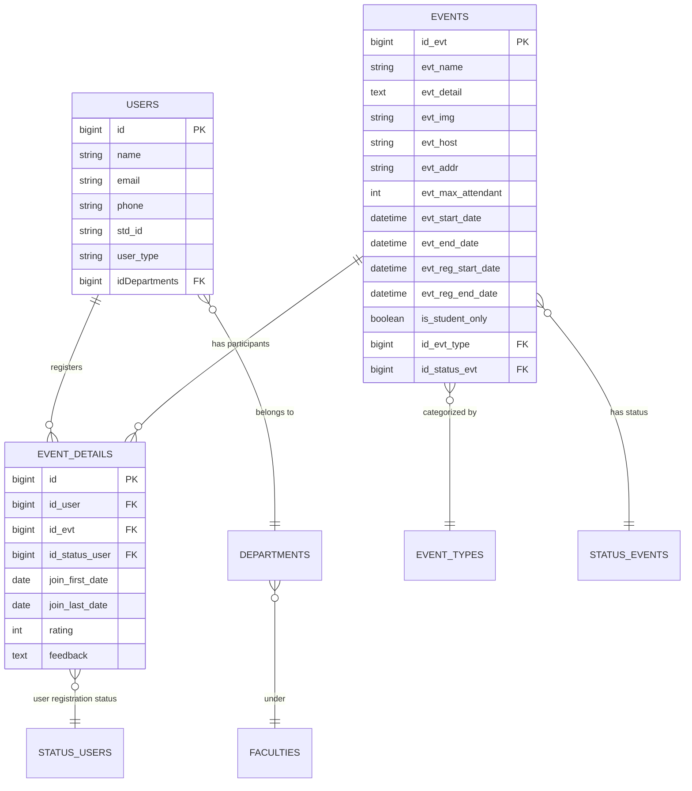
```mermaid
erDiagram
    USERS ||--o{ EVENT_DETAILS : "registers"
    USERS }o--|| DEPARTMENTS : "belongs to"
    DEPARTMENTS }o--|| FACULTIES : "under"
    EVENTS ||--o{ EVENT_DETAILS : "has participants"
    EVENTS }o--|| EVENT_TYPES : "categorized by"
    EVENTS }o--|| STATUS_EVENTS : "has status"
    EVENT_DETAILS }o--|| STATUS_USERS : "user registration status"

    USERS {
        bigint id PK
        string name
        string email
        string phone
        string std_id
        string user_type
        bigint idDepartments FK
    }

    EVENTS {
        bigint id_evt PK
        string evt_name
        text evt_detail
        string evt_img
        string evt_host
        string evt_addr
        int evt_max_attendant
        datetime evt_start_date
        datetime evt_end_date
        datetime evt_reg_start_date
        datetime evt_reg_end_date
        boolean is_student_only
        bigint id_evt_type FK
        bigint id_status_evt FK
    }

    EVENT_DETAILS {
        bigint id PK
        bigint id_user FK
        bigint id_evt FK
        bigint id_status_user FK
        date join_first_date
        date join_last_date
        int rating
        text feedback
    }
```

---

## 💻 ข้อกำหนดระบบและการติดตั้ง (Installation Guide)

### สิ่งที่ต้องเตรียมล่วงหน้า (Prerequisites)
- **PHP** >= 8.2 (พร้อม Extension: OpenSSL, PDO, Mbstring, Tokenizer, XML, Ctype, JSON, BCMath)
- **Composer** (เวอร์ชันล่าสุด)
- **Node.js** (LTS version) & **npm**
- **Database Server:** MySQL / MariaDB หรือ SQLite

---

### ขั้นตอนการติดตั้ง (Setup Steps)

#### 1. โคลนคลังโค้ด (Clone Repository)
```bash
git clone https://github.com/chaiyawat19/EventHub.git
cd EventHub
```

#### 2. ติดตั้ง PHP Dependencies
```bash
composer install
```

#### 3. ติดตั้ง Node.js Dependencies
```bash
npm install
```

#### 4. ตั้งค่าไฟล์ Environment (.env)
คัดลอกไฟล์ตัวอย่าง `.env.example` เป็น `.env`
```bash
# บน Windows PowerShell
copy .env.example .env

# หรือบน macOS/Linux
cp .env.example .env
```

แก้ไขการเชื่อมต่อฐานข้อมูลใน `.env` ตามสภาพแวดล้อมของคุณ (ตัวอย่างสำหรับ MySQL):
```ini
DB_CONNECTION=mysql
DB_HOST=127.0.0.1
DB_PORT=3306
DB_DATABASE=eventhub
DB_USERNAME=root
DB_PASSWORD=your_password
```
*(หากต้องการใช้ SQLite ให้กำหนด `DB_CONNECTION=sqlite` และสร้างไฟล์ `database/database.sqlite`)*

#### 5. สุ่มสร้าง Application Key
```bash
php artisan key:generate
```

#### 6. เชื่อมโยงโฟลเดอร์สำหรับจัดเก็บไฟล์สาธารณะ (Storage Link)
```bash
php artisan storage:link
```

#### 7. รันการย้ายฐานข้อมูลและ Seed ข้อมูลเริ่มต้น (Migrate & Seed)
```bash
php artisan migrate

# นำเข้าข้อมูลตัวเลือกพื้นฐาน (คณะ, สาขาวิชา, ประเภทกิจกรรม, สถานะ)
php artisan db:seed --class=FacultiesSeeder
php artisan db:seed --class=DepartmentsSeeder
php artisan db:seed --class=EventTypeSeeder
php artisan db:seed --class=StatusEventSeeder
php artisan db:seed --class=StatusUserSeeder
```

#### 8. รันเซิร์ฟเวอร์เพื่อเริ่มใช้งาน (Run Application)
เปิดใช้งาน Frontend Build Server:
```bash
npm run dev
```

เปิดใช้งาน Laravel Local Server อีกหน้าต่าง Terminal:
```bash
php artisan serve
```

เข้าใช้งานผ่านเว็บเบราว์เซอร์ได้ที่: **[http://localhost:8000](http://localhost:8000)** 🎉

---

## 📂 โครงสร้างโปรเจกต์ (Project Structure)

```text
EventHub/
├── EventHub/                    # ภาพต้นแบบหน้าจอระบบ (UI Prototypes & Screenshots)
├── app/
│   ├── Http/
│   │   ├── Controllers/         # คอนโทรลเลอร์หลัก (Admin, User, Event, Report ฯลฯ)
│   │   └── Middleware/          # ตัวกรองสิทธิ์ (AdminMiddleware, Registration Check ฯลฯ)
│   └── Models/                  # Eloquent Models (User, Event, EventDetail ฯลฯ)
├── config/                      # ไฟล์การกำหนดค่าระบบ Laravel
├── database/
│   ├── migrations/              # ตารางฐานข้อมูลทั้งหมด
│   └── seeders/                 # ข้อมูลเริ่มต้น (คณะ, สาขา, สถานะ, ประเภทอีเวนต์)
├── public/
│   ├── css/                     # สไตล์ชีตเฉพาะหน้าจอ
│   └── font/                    # ไฟล์ฟอนต์ไทยกำหนดเอง
├── resources/
│   ├── views/
│   │   ├── admin/               # หน้าจอการทำงานของผู้ดูแลระบบ
│   │   ├── user/                # หน้าจอการลงทะเบียนและประวัติของผู้ใช้
│   │   ├── layouts/             # แม่แบบ Layout ร่วม (Home, Dashboard)
│   │   └── welcome.blade.php    # หน้าแรกของระบบ EventHub
│   └── css/ & js/               # แอสเซทหลักสำหรับคอมไพล์ผ่าน Vite
├── routes/
│   └── web.php                  # กำหนดเส้นทาง URL ทั้งหมดของแอปพลิเคชัน
├── storage/                     # เก็บไฟล์ชั่วคราวและรูปภาพที่อัปโหลด
└── vite.config.js               # การกำหนดค่าตัวคอมไพล์ Vite
```

---

## 🔒 สิทธิ์การใช้งานและบัญชีผู้ใช้ (Roles & Access)

| บทบาท (Role) | ค่าในระบบ (`user_type`) | สิทธิ์การเข้าถึงและการทำงาน |
| :--- | :---: | :--- |
| **Admin** | `admin` | สิทธิ์ระดับผู้ดูแลระบบ: เข้าถึง `/dashboard`, สร้าง/แก้ไข/ลบกิจกรรม, อนุมัติผู้สมัคร, ดูสรุปรายงานและคะแนนประเมิน |
| **User / Student** | `user` (หรือค่าว่าง) | ผู้ใช้ทั่วไป / นักศึกษา: ค้นหากิจกรรม, ลงทะเบียน, จัดการสถานะการสมัครของตนเอง, ส่งแบบประเมินหลังจบงาน |

> [!TIP]
> **การกำหนดสิทธิ์ผู้ดูแลระบบ (Admin Role):**
> คุณสามารถเปลี่ยนฟิลด์ `user_type` ในตาราง `users` ของผู้ใช้ที่ต้องการให้เป็น `'admin'` ผ่านฐานข้อมูล เพื่อเปิดสิทธิ์การใช้งานแผงควบคุมระบบ

---

## 👥 ผู้พัฒนา (Author & Contributors)

- **Chaiyawat Sonachai (Best)** - [@chaiyawat19](https://github.com/chaiyawat19)
- พัฒนาขึ้นเพื่อเป็นระบบศูนย์กลางกิจกรรมและการเรียนรู้ที่มีประสิทธิภาพ

---

## 📄 ใบอนุญาต (License)

โปรเจกต์นี้เผยแพร่ภายใต้ใบอนุญาต **[MIT License](LICENSE)** สามารถนำไปศึกษา ดัดแปลง และพัฒนาต่อยอดได้อย่างอิสระ

<br>

<div align="center">
  <sub>Made with ❤️ by Chaiyawat Sonachai. Powered by Laravel & Tailwind CSS.</sub>
</div>
